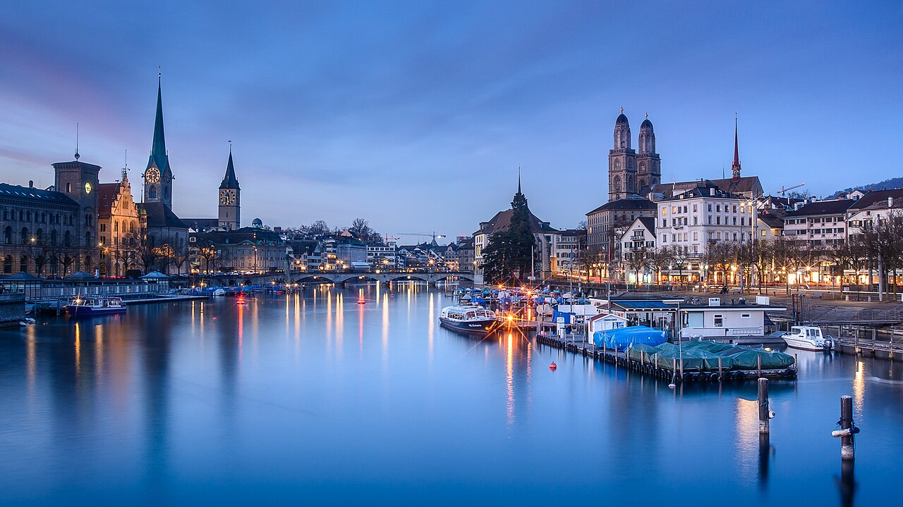

報告主題：智慧都市
===

### 成員
| 職位 | 學號 | 姓名 | 分工 |
| :--: | :--: |:--:| :--: |
| 組長  | C111252124 | 黃于忠 | Githun簡報製作 |
| 組員  | C111252132 | 陳冠中 | 簡報報告 |
| 組員  | C110225113 | 侯竹軒 | 資料收集 |

# 大綱
* ### 什麼是智慧都市
* ### 智慧城市指數與排名
* ### 世界上的智慧都市及相關科技
* ### 智慧都市對我們的影響
* ### 總結

# 什麼是智慧都市
### 智慧城市（英語：Smart City）是指利用各種資訊科技或創新意念，整合都市的組成系統和服務，以提昇資源運用的效率，優化都市管理和服務，以及改善市民生活品質。 像是一些主要特徵圍繞著效率、永續性和安全性等議題，並利用物聯網、大數據、AI或區塊鏈等技術，進行包括緩解交通擁堵、降低污染、微調交通時間表和路線、管理廢棄物、遠端照明、針對一定程度的惡劣天氣發出警告和測量污染等事務。
* 數位化基礎建設：透過智慧感測器、智慧交通系統等，實現城市運作的數位化。
* 智慧化管理：利用大數據分析、AI 等技術，優化城市管理，提高效率。
* 提升公共服務：提供智慧化的公共服務，如智慧交通、智慧醫療、智慧教育等。
* 推動永續發展：透過智慧化技術，實現能源效率提升、減碳目標等。
* 改善生活品質：透過智慧化的城市環境，改善居民生活品質。

資料來源：[維基百科](http://markdown.tw](https://zh.wikipedia.org/zh-tw/%E6%99%BA%E6%85%A7%E5%9F%8E%E5%B8%82 "Title")

# 智慧城市指數與排名
### 智慧城市指數（Smart City Index）是一種評估城市智慧程度的指標，通常由國際機構如瑞士洛桑國際管理發展學院（IMD）發布。 它旨在評估城市在經濟、技術、人文等多個方面，以及在基礎設施、交通、生活品質等領域的表現，從而反映城市發展的智慧程度。 
主要可以分為兩大類，第一類是科技服務，第二類是基礎設施，簡單的提出幾點細項說明。
* 基礎設施：評估城市的交通、能源、水資源、通信等基礎設施的完善程度。
* 技術：評估城市在資訊科技、數位服務、智慧應用等方面的應用程度。
* 經濟：評估城市的經濟發展、產業結構、就業狀況等。
* 人文：評估城市的教育、醫療、文化、環境等方面的發展狀況。
* 生活品質：評估城市的居住環境、生活便利性、安全保障等方面的表現。

### 2024年中，智慧都市的排名前三名分別為，瑞士蘇黎世、挪威奧斯陸、澳洲坎培拉。 
而台灣的臺北市排名則是落在第16名。 

資料來源：[優分析](https://uanalyze.com.tw/articles/606865252 "Title")

# 世界上的智慧都市及相關科技

## 蘇黎世（瑞士）：
### 為什麼蘇黎世會是排名第一呢？ 都是因為其高效的公共運輸系統、智慧能源管理和優質的生活品質聞名。
### 以街邊垃圾為例，你知道蘇黎世的街邊垃圾不是「掃」出來，而是「找」出來的嗎？
#### 蘇黎世引進Cortexia公司開發的「乾淨城市指數」（Clean City Index）智慧系統，它就像城市的「管家」--能掌握全城垃圾，從小於2釐米的紙屑、大到口香糖。 這套系統在時速低於20公里的交通工具，如腳踏車、清掃車、公車等加裝攝影鏡頭，回傳畫面到系統。 透過人工智慧辨識出紙屑、飲料罐、口香糖之類等垃圾，統計出最髒的街道後，優先清掃，高效控管全城大街小巷的整潔。

### 而在追求乾淨能源方面，蘇黎世也不惶多讓。 早在2015年，蘇黎世即在城南打造8公頃的「綠城市（Green City）」，全區綠建築，百分百使用能循環利用的電能（其中70％來自建築屋頂太陽能板）；再裝配智慧控電系統，掌握電力輸出和儲存，使該區成為全球第一被認證的「2000瓦社區」。
（註解：2000-Watt Society,指在不影響生活品質條件之下，居民每小時使用不超過2000瓦／2度天然能源（Primary Energy）所發的電。)

資料來源：[未來城市](https://futurecity.cw.com.tw/article/3248 "Title")
